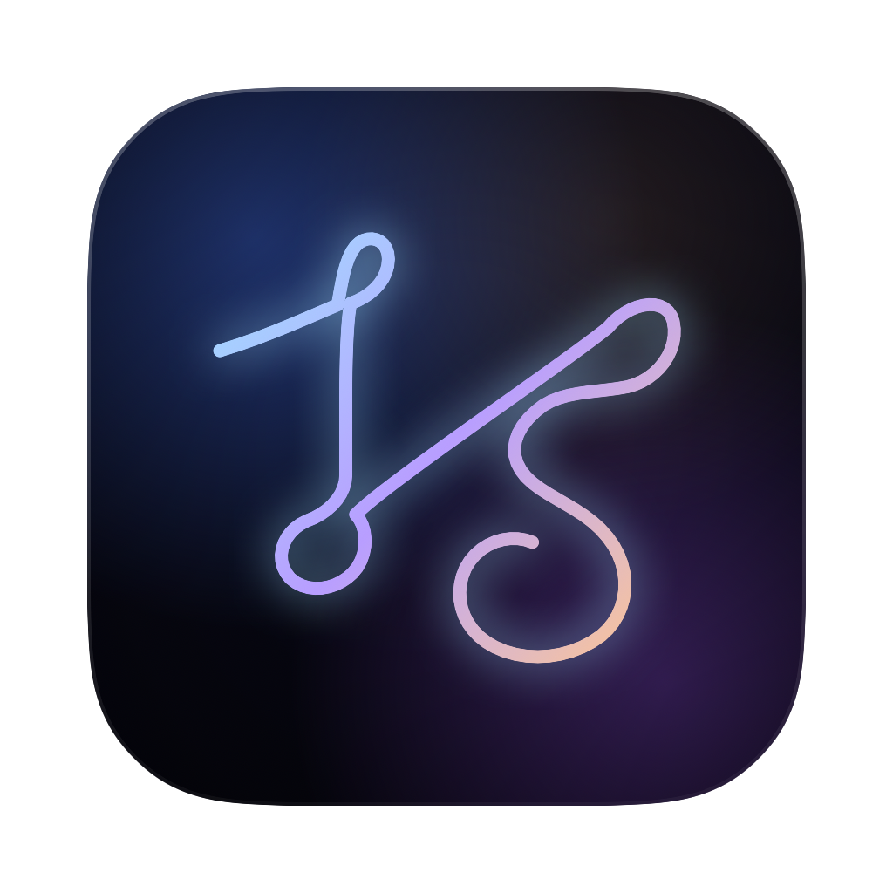

  

<h1 align="center">Lumina Studio</h1>

  <strong>Live wallpapers for your Mac — every display, your way.</strong>

  
  
  

  <a href="https://github.com/Lyfae/Lumina/releases/latest"><strong>Download the latest release →</strong></a>

---

Lumina lives in your menu bar and turns each display into its own canvas. Drop in a video, GIF, or photo slideshow, preview it live, then apply when it looks right — with ambient music and battery-smart playback that knows when to pause.

No subscription. No account. Just your wallpapers.

---

## Install

1. Download **[Lumina from Releases](https://github.com/Lyfae/Lumina/releases/latest)** (`Lumina-x.y.z.dmg`)
2. Open the DMG and drag **Lumina** into **Applications**
3. Open Lumina — you’ll see it in the menu bar (no Dock icon)

**First launch tip:** if macOS blocks the app, right-click **Lumina** → **Open**, or allow it under **System Settings → Privacy & Security**.

---

## Get started

1. Click the Lumina icon in the menu bar → **Lumina Studio** (`⌘M`)
2. Pick a display
3. Add a video, GIF, or image to your library
4. Click a thumbnail to preview it
5. Adjust crop, brightness, speed, and effects
6. Click **Apply to Wallpaper**

**Handy extras**

- **Keep on startup** — restore that wallpaper after reboot  
- **Music Widget** (`⌘⇧M`) — floating mini-player with a scrubbable waveform  
- Minimize Studio (optional) to show the music widget automatically — toggle in Settings  

---

## What you can do

**Wallpapers**
- Video, animated GIF, and still images on every monitor
- Independent crop, speed, volume, and effects per display
- Preview first, then apply — nothing goes live until you say so

**Editing**
- Brightness, color, opacity, and crop with a live preview
- Slideshows with fade or cut, plus optional Ken Burns motion

**Music**
- Ambient tracks in the background while you work
- Shuffle, loop, queue, and a compact floating player

**Power-aware**
- Pauses when you’re on Low Power Mode, under thermal pressure, or in a fullscreen app
- Warns you if a wallpaper is too heavy for smooth playback

---

## Requirements

- Mac running **macOS 15 Sequoia** or later  
- Apple Silicon recommended for the current release builds  

---

## Questions & changes

Want help or an idea considered? Reach out to me ([@Lyfae](https://github.com/Lyfae)).

Prefer to change the code yourself? Fork the repo and open a pull request.

Release notes are on the [Releases](https://github.com/Lyfae/Lumina/releases) page and in **Settings → Version & Status** inside the app.

---

## License

[MIT](LICENSE) — free to use and share.
